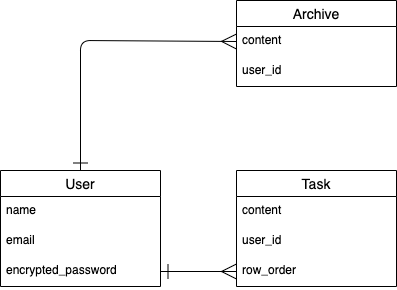

# アプリケーション名
Just Do It
# アプリケーション概要
タスクの管理と終了タスクの確認ができます。頭の中のやらなきゃというモヤモヤを、すべて吐き出すためのアプリです。
# URL
デプロイ済みのURLを記載。デプロイが済んでいない場合は、デプロイが完了次第記載すること。
# テスト用アカウント
ログイン機能等を実装した場合は、ログインに必要な情報を記載。またBasic認証等を設けている場合は、そのID/Passも記載すること。
# 利用方法
- ユーザーでログイン
- タスクを打ち込みセンド
- 一つのタスクが完了したら、タスク横のチェックをつける
- 完了タスクはすべてArchiveに保存される
- 今の作業に集中するとき、タスクをクリックすると画面いっぱいに表示される。集中モード
- 集中モード中も下の入力欄が使えるので、追加タスクもセンドできる
# アプリケーションを作成した背景
次々に仕事が増える場面で、シンプルにメモを残したい人へ向けて開発しました。
完了していないタスクが人目でわかり、今やっていることに集中できるアプリケーションです。
# 洗い出した要件
https://docs.google.com/spreadsheets/d/1YM1vaRb0EL6G3MXe_A0g3NgrtLMiu6er8C5Q75w3FxQ/edit#gid=1002713410
# 実装した機能についての画像やGIFおよびその説明
- 画像は後ほど掲載
- タスクを送信できる投稿機能
- タスクを完了できるアーカイブ機能
- 1つのタスクをクリックすると、他のタスクを見えなくするフォーカス機能
- タスクを並び替えできるソート機能
# 実装予定の機能
- タスクの「今はやらない」エリアを作る
# データベース設計
	
# 画面遷移図
	
# 開発環境
- フロントエンド
- バックエンド
- インフラ
- テスト
- テキストエディタ
- タスク管理
# ローカルでの動作方法
- 以下のコマンドを順に実行
% git clone https://github.com/ruu2023/jdi-app
% cd jdi-app
% bundle install
% yarn install
# 工夫したポイント
	タスクを抱えて頭がモヤモヤすることを解消したく制作しました。
	Ruby on Railsにてアプリを作成し、sortablejsライブラリを使用し、タスクの入れ替えができるようにしました。
	また、cssやjavascriptにてレスポンシブ対応を行いました。
# 改善点
- ユーザーによってはタスクを複数のフォルダに分けると思いますので、自由度の高いフォルダー作成を追加したいです。
# 制作時間
	30h

# テーブル設計

## users テーブル

| Column             | Type   | Options     |
| ------------------ | ------ | ----------- |
| name               | string | null: false |
| email              | string | null: false |
| encrypted_password | string | null: false |

### Association

- has_many :folder_users
- has_many :folders, through: :folder_users
- has_many :tasks

## folders テーブル

| Column | Type   | Options     |
| ------ | ------ | ----------- |
| name   | string | null: false |

### Association

- has_many :folder_users
- has_many :users, through: :folder_users
- has_many :tasks

## folder_users テーブル

| Column | Type       | Options                        |
| ------ | ---------- | ------------------------------ |
| user   | references | null: false, foreign_key: true |
| folder | references | null: false, foreign_key: true |

### Association

- belongs_to :folder
- belongs_to :user

## tasks テーブル

| Column     | Type       | Options                        |
| ---------- | ---------- | ------------------------------ |
| content    | string     |                                |
| check_done | integer    |                                |
| user       | references | null: false, foreign_key: true |
| folder     | references | null: false, foreign_key: true |

### Association

- belongs_to :folder
- belongs_to :user